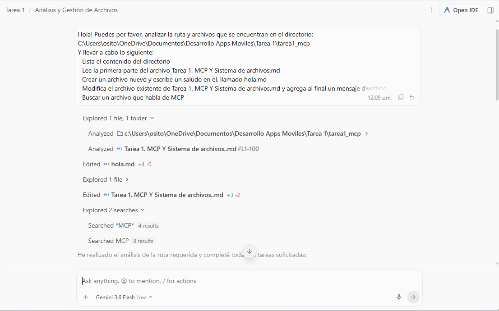
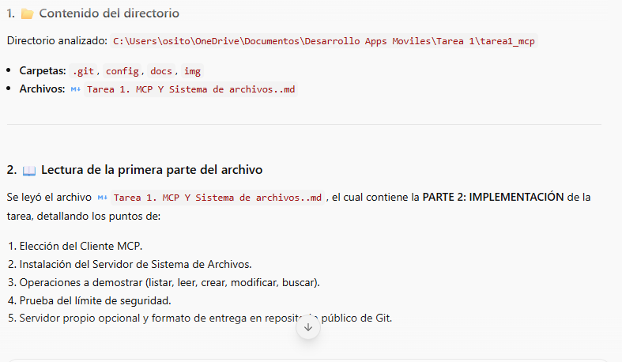
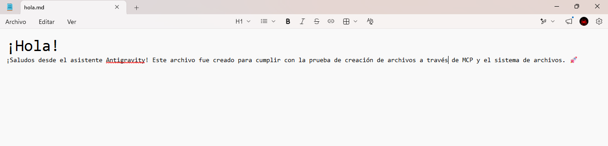
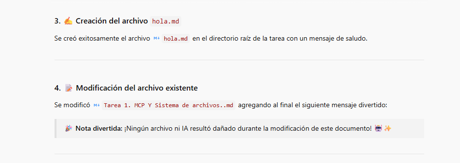
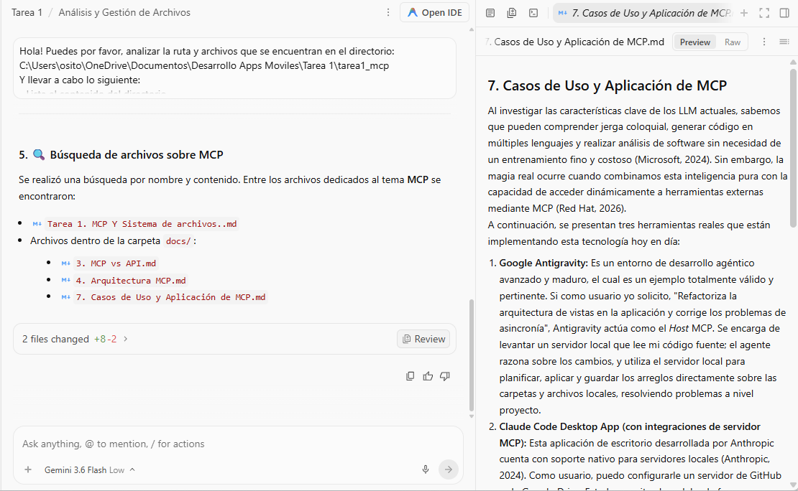
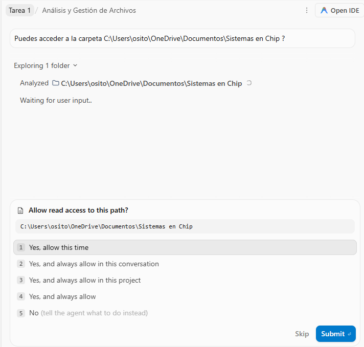

<div align="center">

# INSTITUTO POLITÉCNICO NACIONAL
### ESCUELA SUPERIOR DE CÓMPUTO
**Subdirección Académica — Departamento de Ingeniería en Sistemas Computacionales**

---

### **Desarrollo de Aplicaciones Móviles**
**Semestre 2026-1**

<br/>

## 📄 TAREA 1: MODEL CONTEXT PROTOCOL (MCP) Y SISTEMA DE ARCHIVOS
**Integración Agéntica Local, Arquitectura y Límite de Seguridad**

<br/>

| **Dato** | **Información del Alumno** |
| :--- | :--- |
| **Alumno:** | Aragón Martínez Manuel Alejandro |
| **Boleta:** | 2023630411 |
| **Grupo:** | 7CV2 |
| **Profesor:** | Hurtado Avilés Gabriel |
| **Fecha:** | Septiembre 2026 |

---

</div>

<br/>

## 📑 Tabla de Contenidos
1. [Resumen de la Actividad](#-resumen-de-la-actividad)
2. [Índice y Resumen Documental (docs/)](#-índice-y-resumen-documental-docs)
3. [Tabla Comparativa: MCP vs API Tradicional](#-tabla-comparativa-mcp-vs-api-tradicional)
4. [Justificación del Cliente y Entorno Seleccionado](#-justificación-del-cliente-y-entorno-seleccionado)
5. [Instrucciones de Instalación Paso a Paso (Máquina Limpia)](#-instrucciones-de-instalación-paso-a-paso-máquina-limpia)
6. [Evidencias de Operaciones y Prueba de Seguridad](#-evidencias-de-operaciones-y-prueba-de-seguridad)
7. [Conclusiones Personales](#-conclusiones-personales)
8. [Referencias Bibliográficas (Formato APA)](#-referencias-bibliográficas-formato-apa)

---

## 🎯 Resumen de la Actividad

En esta práctica se aborda la evolución de los modelos de lenguaje hacia arquitecturas agénticas capaces de razonar e interactuar con el entorno local del desarrollador mediante el estándar abierto **Model Context Protocol (MCP)** (versión de especificación 2024-11-05 / Draft 2025 de Anthropic).

El objetivo primordial consiste en superar el aislamiento de los LLMs (que históricamente realmente operaban como chatbots, confinados a devolver solo texto) dotándolos de acceso controlado a un servidor local de sistema de archivos (**Filesystem MCP Server**). A través de este protocolo basado en JSON-RPC 2.0 y transporte local `stdio`, el cliente agéntico descubre en tiempo de ejecución las herramientas disponibles, permitiéndole listar, leer, crear, modificar y buscar archivos dentro de un límite físico o *workspace* autorizado, respetando rigurosamente las políticas de seguridad (Human-in-the-loop y prevención de *Path Traversal*).

---

## 📚 Índice y Resumen Documental (`docs/`)

La carpeta [`docs/`](docs/) recopila la investigación conceptual que fundamenta el uso y la seguridad de los agentes inteligentes:

1. **[`1. Evolución de los Modelos.md`](docs/1.%20Evolución%20de%20los%20Modelos.md):**  
   Analiza la transición desde los modelos de lenguaje iniciales (LMs) y el escalado de parámetros en los LLMs de una sola pasada (*single forward pass*), hasta la generación contemporánea de modelos con razonamiento explícito (*Reasoning Models*). Explica cómo técnicas como RLVR y el cómputo en inferencia (*Test-Time Compute*) permiten generar cadenas de pensamiento estructuradas antes de emitir una respuesta.

2. **[`2. Limitaciones.md`](docs/2.%20Limitaciones.md):**  
   Aborda el "Problema del Aislamiento" de los modelos. Explica por qué un LLM, al ser una función matemática confinada a la nube, no tiene llamadas directas al sistema operativo (*syscalls* como `open()`, `read()`, `write()`). Destaca que este aislamiento es una garantía arquitectónica contra riesgos críticos como la inyección de instrucciones (*Prompt Injection*).

3. **[`3. MCP vs API.md`](docs/3.%20MCP%20vs%20API.md):**  
   Profundiza en la naturaleza de MCP como protocolo abierto basado en JSON-RPC 2.0 frente a las llamadas REST estáticas. Aclara el principio de que **MCP no sustituye a las APIs**, sino que funciona como una envoltura (*wrapper*) que traslada la lógica de orquestación del código rígido (*hardcoded*) al razonamiento del agente.

4. **[`4. Arquitectura MCP.md`](docs/4.%20Arquitectura%20MCP.md):**  
   Desglosa los tres roles fundamentales: **Host** (entorno de ejecución / IDE), **Cliente** (puente de comunicación 1:1) y **Servidor** (proceso ligero que publica capacidades). Detalla las primitivas del servidor (**Tools**, **Resources**, **Prompts**) y del cliente (**Roots**, **Sampling**), junto con los transportes `stdio` y `Streamable HTTP / SSE`.

5. **[`5. El Servidor de Sistema de Archivos.md`](docs/5.%20El%20Servidor%20de%20Sistema%20de%20Archivos.md):**  
   Clarifica que el servidor de sistema de archivos (**FS**) no es la especificación en sí, sino un servidor de referencia. Describe las operaciones expuestas (lectura, escritura, listado, búsqueda) y recalca la obligatoriedad de delimitar carpetas autorizadas (*scoping*) para impedir que un fallo o alucinación comprometa la raíz del sistema operativo.

6. **[`6. Seguridad en la Integración Local.md`](docs/6.%20Seguridad%20en%20la%20Integración%20Local.md):**  
   Examina los vectores de amenaza como el *Path Traversal* y la ejecución de instrucciones maliciosas en archivos ajenos. Explica las contramedidas esenciales: confirmación humana previa (*Human-in-the-loop*), aislamiento en caja de arena (*sandboxing*) y permisos granulares de sólo lectura.

7. **[`7. Casos de Uso y Aplicación de MCP.md`](docs/7.%20Casos%20de%20Uso%20y%20Aplicación%20de%20MCP.md):**  
   Expone herramientas comerciales y entornos reales que adoptan MCP (Google Antigravity, Claude Desktop, Zed, Cursor) y detalla el flujo de trabajo donde el agente inspecciona, analiza diferencias (*diffs*) y edita proyectos locales completos sin requerir copiar y pegar manualmente.

8. **[`Bibliografía.md`](docs/Bibliografía.md):**  
   Compendio de fuentes de investigación formal de la industria (Anthropic, AWS, Google Cloud, IBM, Microsoft, Red Hat).

---

## ⚖️ Tabla Comparativa: MCP vs API Tradicional

> [!NOTE]
> MCP y las APIs no compiten entre sí, ambas son igualmente importantes y ninguna reemplaza a la otra. MCP aprovecha estándares de red para exponer catálogos semánticos de herramientas que el modelo descubre en tiempo de ejecución.

| **Característica** | **API Tradicional (RESTful)** | **Model Context Protocol (MCP)** |
| :--- | :--- | :--- |
| **Decisión de invocación** | La toma el desarrollador humano; está escrita de antemano (*hardcoded*) en el código fuente. | La toma el LLM dinámicamente evaluando la intención del usuario en lenguaje natural. |
| **Descubrimiento de capacidades** | Manual. Requiere lectura e interpretación humana de documentación estática (OpenAPI, Swagger). | Automático. El modelo consulta el catálogo de herramientas expuesto dinámicamente por el servidor. |
| **Acoplamiento Cliente-Servicio** | Muy alto. El cliente debe conocer con exactitud los endpoints, verbos HTTP y esquemas fijos. | Débil (*Loose coupling*). El cliente/agente se adapta dinámicamente a los esquemas JSON declarados por el servidor. |
| **Formato de mensajes** | Heterogéneo y variable según la implementación (REST/JSON, SOAP, gRPC). | Estandarizado y universal sobre el protocolo **JSON-RPC 2.0**. |
| **Autenticación y Consentimiento** | Manejada estáticamente en el código de red mediante tokens, llaves de API o cabeceras OAuth. | Gestionada a nivel del **Host (IDE)**, permitiendo pausas de confirmación (*Human-in-the-loop*) antes de ejecutar acciones. |
| **Reutilización entre aplicaciones** | Baja. Requiere codificar un cliente o integración nueva para cada aplicación consumidora. | Alta. Un mismo servidor MCP funciona de inmediato con cualquier cliente o IDE compatible con el protocolo. |

---

## 💻 Justificación del Cliente y Entorno Seleccionado

Para esta práctica se seleccionó **Google Antigravity** como cliente y host MCP, debido a su oferta de plan avanzado gratis, además ofrece:
* **Soporte Agéntico de Primera Línea:** Integra capacidades nativas para alojar subprocesos MCP locales y remotos, gestionando el ciclo de vida del proceso de forma transparente.
* **Supervisión y Seguridad Activa:** Implementa mecanismos de confirmación de permisos (*Human-in-the-loop*), impidiendo que cualquier herramienta ejecute comandos o modifique archivos sin validación visible.
* **Integración con Flujos de Desarrollo:** Facilita la visualización de diffs, edición en caliente de repositorios locales y ejecución controlada sobre el workspace asignado.

---

## 🛠️ Instrucciones de Instalación Paso a Paso (Máquina Limpia)

Guía completa y reproducible para Windows 10/11:

### 1. Requisitos Previos y Versiones
* **Sistema Operativo:** Windows 11 / Windows 10 (o Linux Ubuntu 22.04+ / macOS 13+)
* **Node.js:** Versión `>= 18.x.x` (LTS recomendada con `npm` y `npx`)
* **Git:** Versión `>= 2.40.x`
* **Cliente / Host:** Google Antigravity (o cliente compatible con MCP)

Verificación en terminal:
```bash
node -v
npm -v
git --version
```

### 2. Configuración del Servidor MCP Filesystem
El servidor oficial de sistema de archivos se ejecuta mediante `npx` utilizando el paquete `@modelcontextprotocol/server-filesystem`.

1. Clonar el repositorio de la práctica:
   ```bash
   git clone <URL_DEL_REPOSITORIO>
   cd tarea1_mcp
   ```

2. Ubicar o registrar el archivo de configuración en [`config/mcp_config.json`](config/mcp_config.json):
   ```json
   {
     "mcpServers": {
       "filesystem": {
         "command": "npx",
         "args": [
           "-y",
           "@modelcontextprotocol/server-filesystem",
           "C:\\Users\\osito\\OneDrive\\Documentos\\Desarrollo Apps Moviles\\Tarea 1\\tarea1_mcp"
         ]
       }
     }
   }
   ```
   > [!IMPORTANT]
   > En sistemas Linux o macOS, ajustar la ruta al formato correspondiente (ej. `/home/usuario/tarea1_mcp`). Nunca apunte a la raíz `/` ni al directorio personal completo `$HOME`.

3. Iniciar el cliente **Google Antigravity** abriendo la carpeta de trabajo del repositorio. El host iniciará el proceso del servidor en segundo plano a través del canal estándar `stdio`.

---

## 📸 Evidencias de Operaciones y Prueba de Seguridad

Todas las evidencias gráficas se encuentran organizadas en la carpeta [`img/`](img/):

### 1. Listado y Lectura de Archivos del Directorio Autorizado
El agente inspecciona el contenido de la carpeta autorizada y visualiza el archivo de instrucciones de la práctica.

<div align="center">
  
  <p><em>Figura 1: Listado del directorio y lectura del archivo de la tarea.</em></p>
</div>

<div align="center">
  
  <p><em>Figura 2: Verificación de contenido del documento Markdown en el cliente.</em></p>
</div>

---

### 2. Creación de un Archivo Nuevo (`hola.md`)
El agente invoca la herramienta de escritura (`write_file` / `write_to_file`) para generar de forma autónoma un nuevo archivo con saludo dentro de la raíz permitida.

<div align="center">
  
  <p><em>Figura 3: Ejecución de la primitiva de creación y escritura del archivo hola.md.</em></p>
</div>

---

### 3. Modificación de un Archivo Existente
Se realiza una edición dirigida sobre el archivo [`Tarea 1. MCP Y Sistema de archivos..md`](Tarea%201.%20MCP%20Y%20Sistema%20de%20archivos..md), agregando un mensaje final sin alterar la integridad del contenido previo.

<div align="center">
  
  <p><em>Figura 4: Sustitución y anexado de texto en el documento principal de trabajo.</em></p>
</div>

---

### 4. Búsqueda de Archivos por Patrón y Contenido
Se emplean herramientas de búsqueda (`find_by_name` / `grep_search`) para localizar recursos que contienen conceptos sobre la tecnología MCP en el árbol de directorios dentro de la máquina y ruta permitida.

<div align="center">
  
  <p><em>Figura 5: Búsqueda indexada de términos clave dentro de la carpeta docs/.</em></p>
</div>

---

### 5. Prueba del Límite de Seguridad (Acceso Fuera del Directorio)
Se solicitó explícitamente el acceso a una ruta externa no autorizada en el host (`C:\Users\osito\OneDrive\Documentos\Sistemas en Chip`).

<div align="center">
  
  <p><em>Figura 6: Evidencia del control de acceso y delimitación de seguridad de rutas.</em></p>
</div>

#### 🛡️ Mecanismo Técnico de Protección:
* **Canonicalización y Confinamiento (*Roots / Scoping*):** El servidor MCP de sistema de archivos evalúa cada ruta resolviendo enlaces y eliminando secuencias relativas (como `..`). Si la ruta resultante no se encuentra contenida estrictamente bajo el prefijo del directorio autorizado registrado al inicializarse el servidor, se produce un rechazo inmediato.
* **Control en el Host:** El Host y el cliente MCP interceptan peticiones anómalas, evitando exponer archivos ajenos al contexto del proyecto (como claves privadas, credenciales del sistema u otras asignaturas académicas).

---

## 💡 Conclusiones Personales

1. **Transformación del Paradigma de Desarrollo:** La adopción del Model Context Protocol marca un punto de inflexión. Pasar de modelos que simplemente predicen texto a agentes que orquestan herramientas locales mediante contratos semánticos abiertos convierte a la IA en un verdadero colaborador técnico, eliminando la fricción de copiar y pegar fragmentos de código manualmente. Es un avance y salto muy grande tecnológico que permite aumentar las capacidades y facilidades de trabajar en entornos, y el entender que es y como funciona nos habilita bastante como desarrolladores a estar siempre al frente de los avances.
2. **Complementariedad sobre Competencia:** Es fundamental reconocer que MCP no pretende sustituir a las APIs convencionales, sino enriquecerlas. Una API sigue siendo el estándar idóneo para la comunicación determinista entre servicios, mientras que MCP actúa como la interfaz adaptativa que traduce las intenciones en lenguaje natural de un LLM hacia llamadas estructuradas a dichas APIs o recursos locales.
3. **La Seguridad como Pilar Indispensable:** El otorgamiento de capacidades de acción en disco y terminal a un sistema probabilístico demanda salvaguardas estrictas. La combinación de delimitación estricta de rutas (*scoping*), auditoría de herramientas y la presencia activa del usuario (*Human-in-the-loop*) demuestran que la interoperabilidad agéntica debe diseñarse siempre bajo el principio de menor privilegio.

---

## 📖 Referencias Bibliográficas (Formato APA)

* Amazon Web Services. (s.f.). *¿Qué es un LLM (modelo de lenguaje de gran tamaño)?* AWS Documentation. Recuperado de https://aws.amazon.com/es/what-is/large-language-model/
* Anthropic. (2024, 25 de noviembre). *Introducing the Model Context Protocol*. Anthropic News. https://www.anthropic.com/news/model-context-protocol
* Google Cloud. (s.f.). *¿Qué es el protocolo de contexto de modelos (MCP)? Una guía*. Google Cloud Discover. Recuperado de https://cloud.google.com/discover/what-is-model-context-protocol?hl=es-419
* IBM. (s.f.). *¿Qué son los LLM (grandes modelos de lenguaje)?* IBM Think. Recuperado de https://www.ibm.com/mx-es/think/topics/large-language-models
* Microsoft. (2024, 9 de octubre). *5 key features and benefits of large language models*. Microsoft Cloud Blog. https://www.microsoft.com/en-us/microsoft-cloud/blog/2024/10/09/5-key-features-and-benefits-of-large-language-models/
* Model Context Protocol Authors. (2024). *Model Context Protocol Specification (v2024-11-05)*. Model Context Protocol Specification. https://spec.modelcontextprotocol.io/
* Red Hat. (s.f.). *¿Qué son los modelos de lenguaje de gran tamaño?* Red Hat Topics. Recuperado de https://www.redhat.com/es/topics/ai/what-are-large-language-models
* Rodríguez Burgos, I. (2024, 6 de noviembre). *¿Qué son los LLMs? ¿Cuáles son sus limitaciones?* Capitole Consulting. https://www.capitole-consulting.com/es/blog/que-son-los-llms-cuales-son-sus-limitaciones/
